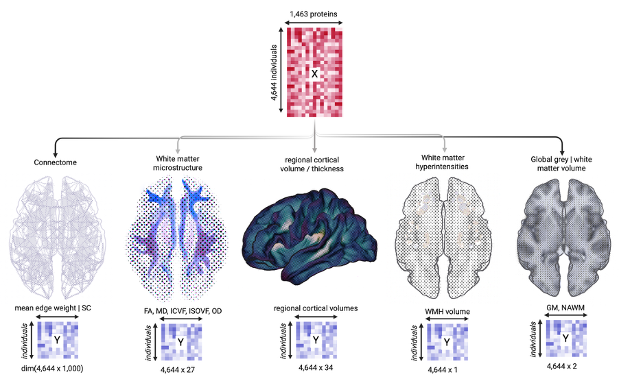
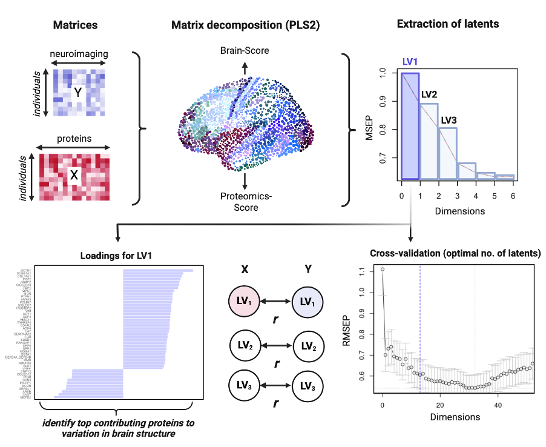

# UKB_PPP_Connectome
Code repositry for 'A data-driven approach to characterising the proteome-connectome in UKBiobank' (Conole et al., 2026)

Here, we use PLS2 as a dimensionality reduction technique to examine proteome–connectome associations as well as other dimensions of brain health in the UKBiobank cohort. We will compare this approach against PCA and penalised regression-derived ProteinScores. We aim to reveal distinct sets of interrelated proteins that span a gradient of brain structure heterogeneity, and show that peripheral signatures reflective of the wider health profile may relate to systematic variation in microstructure and large-scale brain structural variation in adulthood.

## Research Aims and Questions

### Aim 1: To elucidate the relationship between the plasma proteome and brain structure.
•	RQ1.1: Are differential concentrations of plasma proteins associated with global metrics (global grey matter, global white matter volume, global fractional anisotropy and mean diffusivity)
•	RQ1.2: What is the relationship between plasma protein levels and regional cortical volume variations?
•	RQ1.3: How does the plasma proteome relate to white matter microstructure and the connectome?
•	RQ1.4: To what extent do plasma protein variations correspond with markers of small vessel disease, specifically white matter hyperintensity volume?
### Aim 2: To explore the functional implications of proteins significant to brain health.
•	RQ2.1: Which biological pathways are enriched among proteins linked to neuroimaging metrics, and what do these suggest about their roles in brain health and disease?
### Aim 3: To assess the effects of lifestyle factors on proteome-brain structure relationships.
•	RQ3: How do lifestyle factors and vascular risk markers influence the associations between the plasma proteome and neuroimaging outcomes?
### Aim 4: To compare the efficacy of top-contributing proteins against composite inflammatory signatures in predicting brain health.
•	RQ4.1: Do proteins with the highest contributions to predictive models outperform a generalised inflammatory signature in relation to neuroimaging metrics?
•	RQ4.2: How do these proteins compare to composite ProteinScores developed for inflammatory conditions in their explanatory power for variations in neuroimaging metrics?

The examination of the plasma proteome with multifaceted neuroimaging metrics. Integration of plasma proteomic data as the input (X) with various neuroimaging measures as outcomes (Y) in a series of PLS2 models. The central proteomics matrix represents data for ~ 1,463 proteins across 4,644 individuals*, and serves as the consistent predictor set across multiple models. To the far left, the structural connectome maps white matter connectivity by tracing interconnections throughout the brain, enabling the computation of network metrics, using network metrics streamline count (SC) to assess the brain's network integrity. Adjacent, white matter microstructure will be analysed with metrics such as fractional anisotropy (FA), mean diffusivity (MD), intracellular volume fraction (ICVF), isotropic volume fraction (ISOVF), and orientation dispersion (OD), across 27 white matter tracts. Regional cortical volume and thickness across 34 areas, volume of white matter hyperintensities (WMH) and global grey and white matter volumes are also to be evaluated in their relation to proteomic variance. Each neuroimaging metric is paired with its corresponding Y matrix, illustrating the dimensions of the outcome data in relation to the uniform proteomics input. Together, these analyses represent a comprehensive examination of how peripheral protein profiles may relate to diverse aspects of brain structure and pathology. *exact numbers to be determined after data pre-processing*

## PLS2

Simplified workflow of PLS2 as a method of dimensionality reduction in characterising the proteome-connectome. Top panel shows how PLS2 finds relevant components that maximise the covariance between the response (X) and predictor (Y) variables, quantifying patterns of correlated covariance between plasma proteomic profiles and neuroimaging metrics. The matrices (top left) represent the raw data inputs, with proteomic data matrix as predictors (X) and neuroimaging data matrix as outcomes (Y). PLS2 matrix decomposition generates latent variables (LVs) that encapsulate the shared variance between the proteomic and neuroimaging datasets, yielding Proteomics-Scores and Brain-Scores for each individual. The extraction of latents is determined based off plotting error across dimensions, identifying the optimal number of LVs that minimize the prediction error; cross-validation enables us to pinpointing the optimal count of latent variables that balance model complexity and predictive accuracy, as shown by the plot of Root Mean Squared Error of Prediction (RMSEP) against the number of dimensions, Together, these components streamline the identification of parsimonious biological relationships within multidimensional biomedical data.
